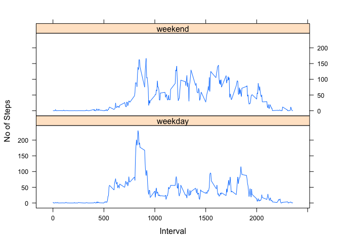

# Reproducible Research: Peer Assessment 1


## Loading and preprocessing the data
Reading the csv file

```r
dat0 <- read.csv("activity.csv")
```
Transforming Date variable from character to date format

```r
dat0$date <- as.Date(dat0$date,"%Y-%m-%d")
```

## What is mean total number of steps taken per day?
Aggregating total no of steps over day to new data frame

```r
dat1 <- aggregate(steps~date,dat0,sum,na.rm=TRUE)
```
Plotting histogram of total number of steps per day

```r
hist(dat1$steps,main="Histogram of Total Steps per Day",xlab="No of Steps")
```

 

Mean and median of total number of steps per day

```r
mean(dat1$steps)
```

```
## [1] 10766.19
```

```r
median(dat1$steps)
```

```
## [1] 10765
```

## What is the average daily activity pattern?
Aggregating mean no of steps over interval to new data frame

```r
dat2 <- aggregate(steps~interval,dat0,mean,na.rm=TRUE)
```
Plotting time series plot of average daily activity pattern

```r
plot(dat2$interval,dat2$steps,main="Average Daily Activity Pattern",
     xlab="5-Minute Interval",ylab="Average No of Steps",type="l")
```

 

Getting interval which contains max no of steps

```r
dat2$interval[which(dat2$steps==max(dat2$steps))]
```

```
## [1] 835
```

## Imputing missing values
Getting total number of missing values

```r
sum(is.na(dat0))
```

```
## [1] 2304
```
Using mean no of steps per 5-minute interval for missing values imputation

```r
dat3 <- dat0
dat3$steps[is.na(dat3$steps)] <- dat2[match(dat0$interval[is.na(dat0$steps)],
                                            dat2$interval),"steps"]
```
Aggregate total no of steps over day to new data frame

```r
dat4 <- aggregate(steps~date,dat3,sum,na.rm=TRUE)
```
Plotting histogram of total steps per day after imputation

```r
hist(dat4$steps,main="Histogram of Total Steps per Day",xlab="No of Steps")
```

 

Getting mean and median of total steps per day, the values are close to mean and median 
before imputation as my imputation strategy is using no of steps for 5-minute
interval averaged over day

```r
mean(dat4$steps)
```

```
## [1] 10766.19
```

```r
median(dat4$steps)
```

```
## [1] 10766.19
```

## Are there differences in activity patterns between weekdays and weekends?
Creating new factor variable which indicates weekday or weekend

```r
dat3$daytype <- ifelse(weekdays(dat3$date) %in% c("Saturday","Sunday"),
                       "weekend","weekday")
dat3$daytype <- as.factor(dat3$daytype)
```
Aggregating mean no of steps over interval and daytype to a new data frame

```r
dat5 <- aggregate(steps~interval+daytype,dat3,mean,na.rm=TRUE)
```
Plotting time series plot of average daily activity pattern by weekday and weekend

```r
library(lattice)
xyplot(steps ~ interval | daytype, data=dat5, type="l", layout=c(1,2),
       xlab="Interval", ylab="No of Steps")
```

 
